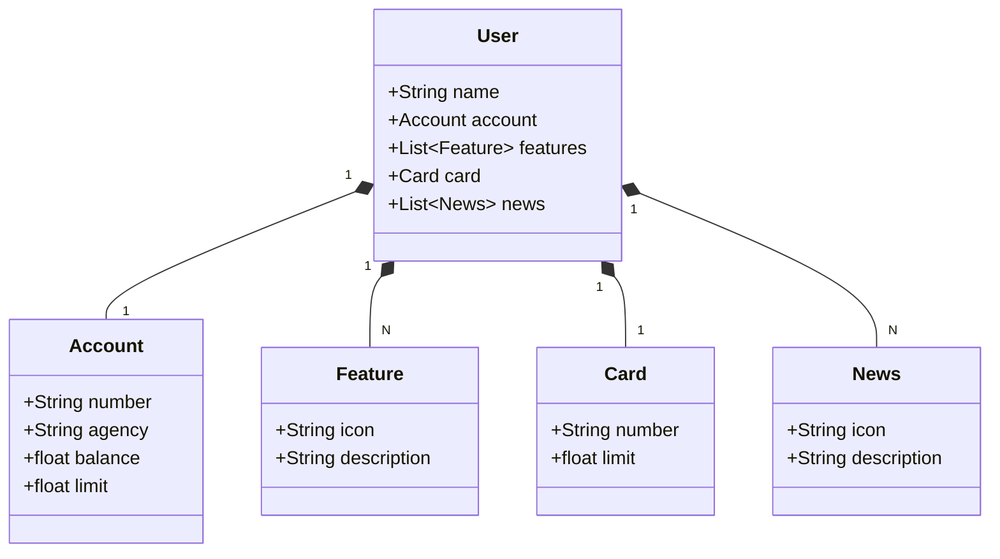

# Santander Dev Week 2023 - API RESTful

Esta é a API RESTful desenvolvida para o evento Santander Dev Week 2023, utilizando Java 17 e Spring Boot 3. O projeto foi desenvolvido para demonstrar a criação e consumo de APIs com integração com banco de dados, documentação OpenAPI (Swagger) e deploy na nuvem com Railway.

## Tecnologias Utilizadas

- **Java 17**: A versão LTS mais recente do Java.
- **Spring Boot 3**: Framework para criação de APIs rápidas e produtivas.
- **Spring Data JPA**: Simplifica a integração com bancos de dados SQL.
- **OpenAPI (Swagger)**: Documentação interativa da API.
- **Railway**: Deploy e monitoramento da aplicação na nuvem.
- **MySQL**: Banco de dados utilizado para armazenar as informações dos usuários.

## Funcionalidades

A API oferece os seguintes recursos:

- **GET /users/{id}**: Retorna os detalhes de um usuário específico.
- **POST /users**: Cria um novo usuário.
- **PUT /users/{id}**: Atualiza os dados de um usuário existente.

## UML

