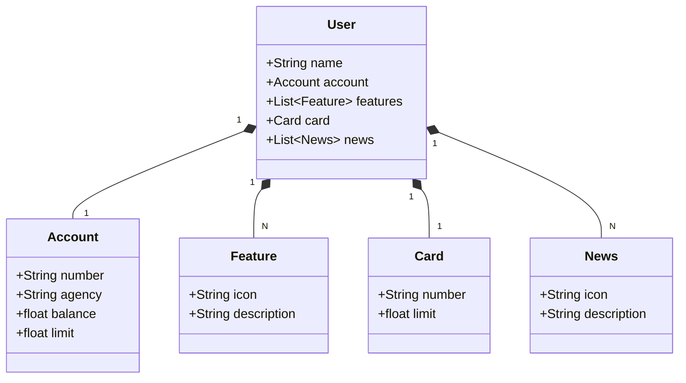

# 💳 API REST - Santander Dev Week 2023

Este projeto é uma API RESTful desenvolvida com **Java 17** e **Spring Boot 3** para o backend do app bancário do Santander, como parte do desafio **Dev Week Santander 2023** e do **bootcamp Decola Tech 2025** da **DIO** em parceria com a **Avanade**.

A solução foi projetada para gerenciar usuários e informações bancárias, com integração ao banco de dados **PostgreSQL** usando **Spring Data JPA**, garantindo persistência eficiente e segura. Toda a API está documentada com **OpenAPI (Swagger)**, permitindo fácil visualização e testes dos endpoints.

Esse projeto foi uma oportunidade para aprofundar meus conhecimentos em desenvolvimento backend com foco em APIs, banco de dados, boas práticas e deploy em nuvem.

##  Tecnologias e Ferramentas

- **Java 17**
- **Spring Boot 3**
- **Spring Data JPA**
- **PostgreSQL**
- **OpenAPI (Swagger)**
- **Railway** (deploy e monitoramento)

##  Funcionalidades

- `GET /users/{id}`: Buscar dados de um usuário.
- `POST /users`: Criar novo usuário.
- `PUT /users/{id}`: Atualizar informações do usuário.

## UML

